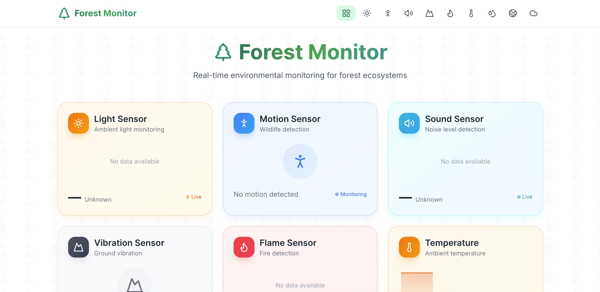
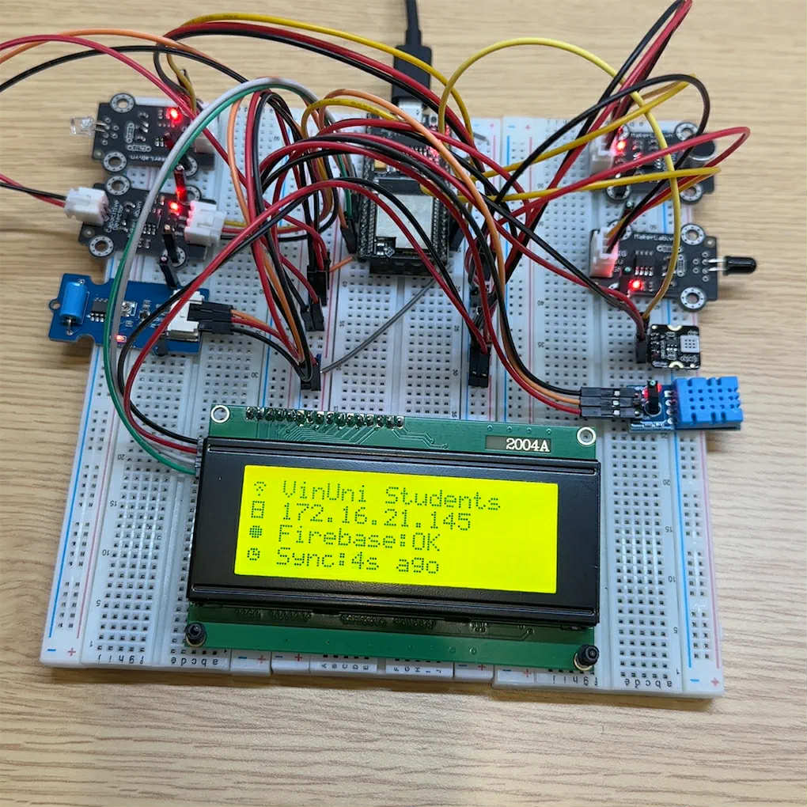
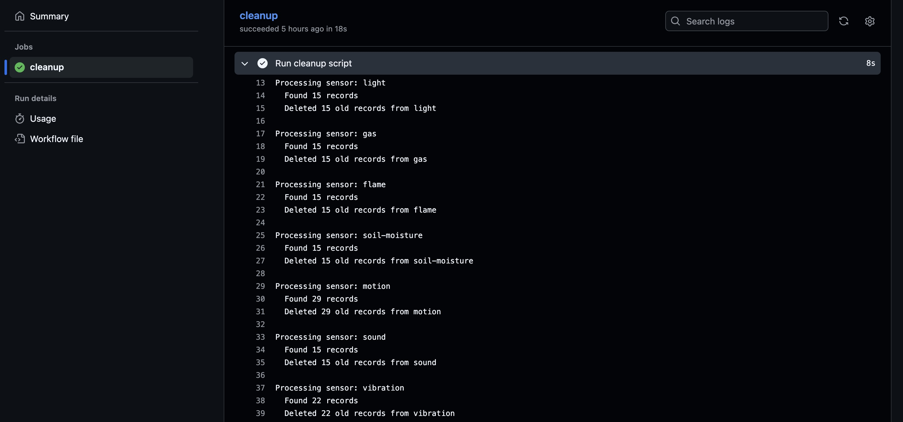

# Forest Monitor (ESP32 + Firebase + Next.js)

Realtime environmental monitoring: an ESP32 reads sensors, pushes data to Firebase Realtime Database, a Next.js dashboard renders live charts, and a scheduled GitHub Actions job deletes old records.

## Demo

Live demo: https://forest-monitor.vercel.app/







## End-to-end flow

```mermaid
flowchart LR
	ESP32[ESP32 + sensors] -->|Connects to WiFi (primary / enterprise fallback)| NET[Network]
	NET -->|Writes readings| RTDB[(Firebase Realtime Database)]
	RTDB -->|Realtime subscriptions| WEB[Next.js dashboard]
	GA[GitHub Actions (daily cron)] --> CLEAN[Cleanup job]
	CLEAN -->|Deletes records older than retention window| RTDB
```

## What’s in this repo

- `esp32/` — PlatformIO firmware
	- WiFi: primary WPA2-Personal, fallback WPA2-Enterprise
	- Uploads readings under `sensors/<type>/<push-id>` with server timestamps
- `web/` — Next.js dashboard
	- Subscribes with `orderByChild('timestamp')` + `limitToLast(20)` + `onValue(...)`
- `cronjob/` — cleanup script + GitHub Actions workflow
	- Runs daily at 00:00 UTC via `.github/workflows/delete-old-records.yml`
	- Deletes records older than 3 days (configurable in `cronjob/src/index.ts`)

## Quick start

1. **ESP32**: configure WiFi + Firebase credentials in `esp32/include/secrets.h`, then build/upload.
	 - Details: [esp32/README.md](esp32/README.md)
2. **Web**: set Firebase client env vars in `web/.env.local`, then run `pnpm install && pnpm dev`.
	 - Details: [web/README.md](web/README.md)
3. **Cleanup**: add GitHub Actions secrets `FIREBASE_DATABASE_URL` and `FIREBASE_AUTH_TOKEN`.
	 - Details: [cronjob/SETUP.md](cronjob/SETUP.md)

## Notes

- `web/.env.local` and `esp32/include/secrets.h` are intentionally ignored—don’t commit secrets.

